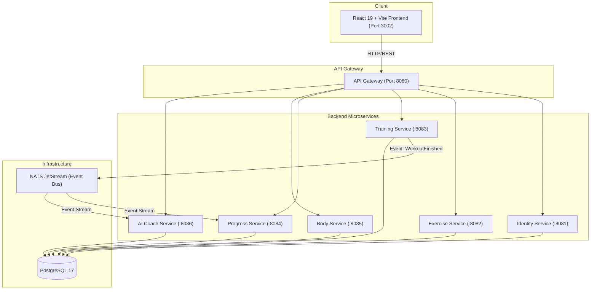

# NeverPaidHealth 🏋️‍♂️⚡

> **NeverPaidHealth** is a modern, privacy-first, enterprise-grade strength training and workout tracking platform inspired by Hevy and Strong. Built with **Go (Clean Architecture / DDD Microservices)**, **NATS JetStream**, **PostgreSQL**, and **React 19 / TypeScript / Tailwind CSS**.

---

## 🚀 Key Features

* **Interactive Workout Logging (Hevy-style)**:
  * Full real-time workout tracking with auto-calculating 1RM (Brzycki/Epley), dynamic set types (Normal, Warmup, Drop Set, Failure), rest timers, and exercise replacement.
  * Instant local 0ms startup with offline resiliency and background synchronization.
* **Movement & Visual Catalog (870+ Exercises)**:
  * Animated exercise illustrations, muscle group targeting, equipment filters, and 1-tap form guides.
* **Interactive Workout Calendar & Consistency Heatmap**:
  * Month grid navigation with color-coded split tags (Push, Pull, Legs, Upper, Lower, Full Body).
  * 52-week annual GitHub-style training density matrix.
  * 1-click day inspection showing full session metrics and set breakdowns.
* **Advanced Analytics Powerhouse**:
  * Volume trend charts, MEV/MRV muscle hypertrophy heatmaps, strength level benchmark standards (Beginner to Elite), and Personal Records (PRs) Hall of Fame.
* **AI Strength Coach**:
  * Real-time CNS readiness & recovery scoring (0–100), progressive overload recommendations (+2.5 kg / reps), plateau warnings, and interactive bilingual sports science consultation.
* **Body Metrics & Health Calculator**:
  * Height/weight tracking, automatic BMI calculation, body fat estimation, and daily TDEE energy expenditure.
* **Athlete Profile**:
  * Unit preferences (KG $\leftrightarrow$ LB), configurable rest timers with audio chimes, and 1-click JSON backup export.

---

## 🏛 Clean Architecture & Microservices



### Microservices Breakdown:
1. **API Gateway (`/gateway`)**: Central routing, rate limiting, and CORS handling.
2. **Identity Service (`/services/identity`)**: User authentication, JWT issuance, profile settings, and unit preferences.
3. **Exercise Service (`/services/exercise`)**: Comprehensive exercise catalog, muscle groups, equipment, and illustration metadata.
4. **Training Service (`/services/training`)**: Active workout sessions, routines management, and set logging. Emits domain events (`WorkoutFinished`).
5. **Progress Service (`/services/progress`)**: Analytics aggregator, volume progression, personal records (PRs), and workout history.
6. **Body Service (`/services/body`)**: Bodyweight, height, BMI, body composition, and anthropometrics.
7. **Coach Service (`/services/coach`)**: AI-driven strength coaching, CNS recovery models, and plateau analysis.

---

## 🛠 Tech Stack

- **Backend**: Go 1.24, Go Workspaces, `chi/v5`, `pgx/v5`, NATS JetStream, Clean Architecture / DDD, Architectural Testing.
- **Frontend**: React 19, TypeScript, Vite, Tailwind CSS, Lucide Icons, Zustand, Vitest.
- **Database**: PostgreSQL 17.
- **Messaging**: NATS JetStream with Transactional Outbox pattern.
- **DevOps**: Docker, Docker Compose, GitHub Actions CI/CD.

---

## 💻 Local Quickstart

### Prerequisites
- [Docker & Docker Compose](https://www.docker.com/)
- [Go 1.24+](https://golang.org/)
- [Node.js 22+](https://nodejs.org/)
- [Task](https://taskfile.dev/) (optional, for automation)

### 1. Run Full Production Stack with Docker Compose
```bash
docker compose -f deploy/docker-compose.prod.yml up --build -d
```
The application will be available at:
- **Frontend**: [http://localhost:3002](http://localhost:3002)
- **API Gateway**: [http://localhost:8080](http://localhost:8080)

### 2. Run Local Development (Services Individually)
```bash
# Start PostgreSQL & NATS
task dev:db

# Run Backend Tests
task test:go

# Run Frontend Tests & Dev Server
cd frontend
npm install
npm run dev
```

---

## 🧪 Testing & Verification

Run the master test gate across all backend microservices and frontend suites:
```bash
# Run full verification
task verify
```

---

## 🔄 CI/CD Pipelines

Automated with GitHub Actions:
- **`ci.yml`**:
  - Validates TypeScript compilation & runs Vitest tests.
  - Runs all Go unit tests & Clean Architecture boundary rules across all microservices.
  - Validates multi-stage Docker builds.
- **`cd.yml`**:
  - Automated deployment on push to `main` branch to target production server using Docker Compose.

---

## 📄 License
MIT License. Built with passion for open strength training and health data sovereignty.
