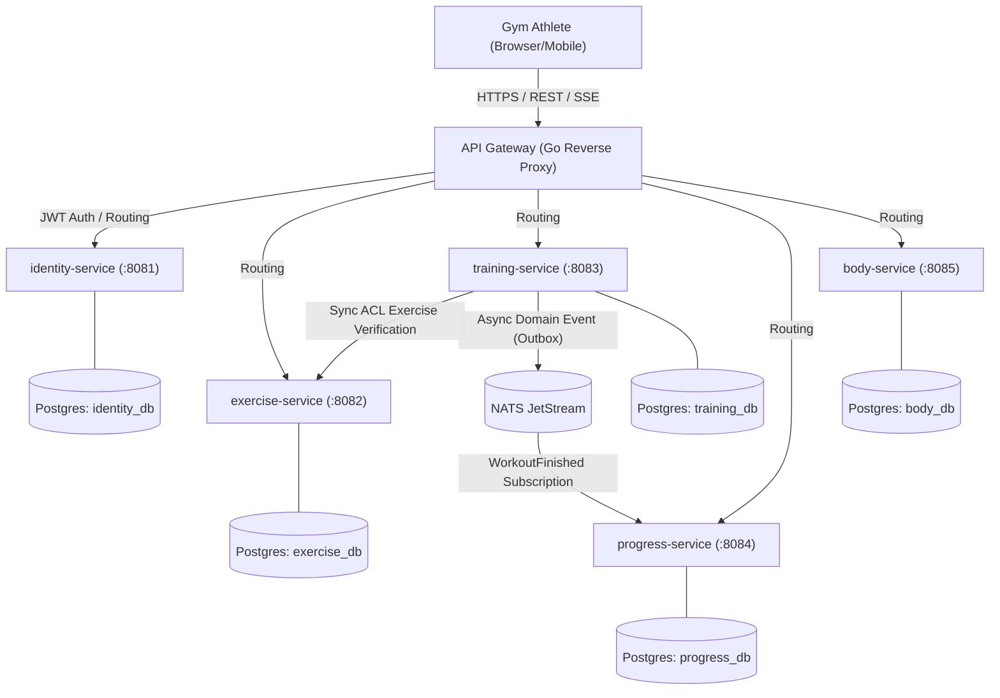

# NeverPaidHealth — System Architecture & C4 Model

## 1. System Context Diagram

NeverPaidHealth is a free, high-performance, local-friendly workout tracker and analytics platform (Hevy alternative).

## 2. Microservices Responsibilities

| Service | Port | Database | Responsibilities |
|---|---|---|---|
| **gateway** | `:8080` | — | Reverse proxy, CORS termination, JWT authentication & claims extraction, `X-User-Id` header injection. |
| **identity-service** | `:8081` | `identity_db` | Google OAuth token verification, Dev-mode fallback, User accounts, Ed25519 JWT issue/refresh, Unit preferences. |
| **exercise-service** | `:8082` | `exercise_db` | Standard library of ~120 exercises, custom user movements, muscle groups, equipment types, HTTP ETag caching. |
| **training-service** | `:8083` | `training_db` | Workout templates (Routines), live in-progress workout sessions, set logging (weight, reps, RPE, type), workout calculations, Transactional Outbox. |
| **progress-service** | `:8084` | `progress_db` | Personal records (PRs) detection, exercise 1RM and volume historical progression series. |
| **body-service** | `:8085` | `body_db` | Daily body measurements (weight, body fat %, circumferences), BMI calculation, 7-day Simple Moving Average trend. |

## 3. Communication Patterns
- **Synchronous:** REST over HTTP/1.1 with OpenAPI 3.1 contracts.
- **Asynchronous:** NATS JetStream pub/sub via Transactional Outbox.
- **Cross-service queries:** Anti-Corruption Layer (ACL) adapters ensure services never leak domain models.
