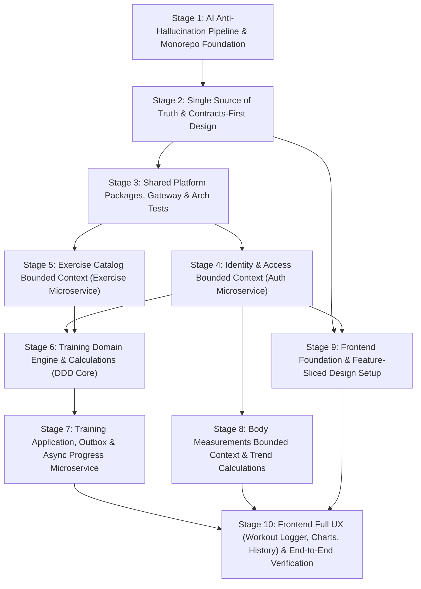

# NeverPaidHealth — 10-Stage Implementation Roadmap

NeverPaidHealth is a free, high-performance workout tracking system (Hevy alternative) built with:
- **Backend:** Go 1.26 microservices, Clean Architecture + DDD, Transactional Outbox + NATS JetStream, Khorikov-style unit testing (2–3 tests per business rule, zero integration tests).
- **Frontend:** React 19 + TypeScript + Vite, Feature-Sliced Design (FSD), TanStack Query v5 + Zustand (offline-resilient active workout state), Tailwind CSS + Radix primitives.
- **AI Development Pipeline:** Strict contracts, Ubiquitous Language glossary, golden calculation test vectors, automated architecture dependency tests, code generation, and quality gates (`task verify`).

---

## 10 Stages Overview

---

## Stages Breakdown Table

| Stage | File | Focus Area | Key Deliverables |
|---|---|---|---|
| **1** | [stage1.md](./stage1.md) | **AI Pipeline & Monorepo Foundation** | `AGENTS.md`, rules, skills, glossary, `Taskfile.yml`, `lefthook.yml`, `docker-compose.yml` (multi-DB Postgres & NATS) |
| **2** | [stage2.md](./stage2.md) | **Contracts-First & Specs** | OpenAPI 3.1 YAMLs, JSON Schema events, `contracts/calculation-vectors.json`, BDD `.feature` specs, codegen config |
| **3** | [stage3.md](./stage3.md) | **Shared Platform & Gateway** | `backend/pkg/{jwtauth,httpx,logx,outbox,natsx,pgxutil}`, API Gateway (CORS, JWT validation), Arch unit tests |
| **4** | [stage4.md](./stage4.md) | **Identity Microservice** | Google OAuth token verification, Dev-mode fallback, User aggregate, Ed25519 JWT issue/refresh, Unit preference VO |
| **5** | [stage5.md](./stage5.md) | **Exercise Microservice** | Exercise aggregate, ~120 seeded exercises, custom exercises, measurement types, ETag HTTP caching, Khorikov tests |
| **6** | [stage6.md](./stage6.md) | **Training Domain Core & Calcs** | Weight/Reps/RPE value objects, pure calculation domain services (Volume, E1RM Epley, Summary), Workout & Routine aggregates |
| **7** | [stage7.md](./stage7.md) | **Training App, Outbox & Progress Service** | Training commands/queries, Postgres outbox, NATS JetStream publisher, `progress-service` consumer, PR detection, History series |
| **8** | [stage8.md](./stage8.md) | **Body Metrics Microservice** | BodyLog aggregate, BMI calculator, 7-day Simple Moving Average trend, daily upsert invariant, Khorikov unit tests |
| **9** | [stage9.md](./stage9.md) | **Frontend Core & FSD Foundation** | React 19 + Vite + Tailwind, Feature-Sliced folder rules, Orval generated API client, Auth state, Theme & Unit switcher |
| **10** | [stage10.md](./stage10.md) | **Frontend Workout UX & E2E Verification** | Active workout logger (Zustand + local storage), rest timer, summary modal, PR toasts, Recharts, `task verify` full pass |

---

## Golden Rules for AI Agents Working on This Project

1. **Never Invent Anything:** Do not create uncontracted endpoints, database columns, or types. Update `contracts/` first, run `task gen`, then implement.
2. **Khorikov Testing Law:** Unit tests only (2–3 tests per business rule: 1 happy path, 1–2 edge/invariant violations). No in-process mocking. No integration tests.
3. **Pure Functional Core:** Domain logic must reside strictly in `internal/domain` (Go) or `entities/*/model` (TS). No side-effects or external library dependencies in domain layers.
4. **Stage Gate:** Never start `stageN+1.md` before all tests and checks in `stageN.md` pass `task verify`.
